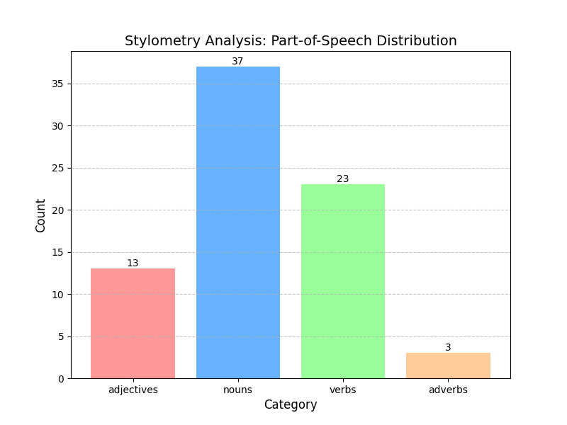

# NLP Text Analyzer Tool

A modular Python CLI tool for analyzing text complexity, sentiment, stylometry and non-standard orthography.

* Tools: Python 3.9
* External Libraries: NLTK, langid, TextBlob, TextStat

## Features

* **Complexity Analysis:** Calculates Flesch Reading Ease score to determine text difficulty.
* **Sentiment Analysis:** Detects polarity and subjectivity.
* **Stylometry:** Analyzes Part-of-Speech (POS) distribution.
* **Visualization:** Generates statistical plots using Matplotlib (e.g., POS distribution, sentence length metrics) and outputs them as PNG/rich-console.
* **Normalization**: Detects and handles non-standard unicode characters or informal spelling patterns.

Output will be given as JSON.

## Setup
Clone the repository into your folder.

### (Optional) Setting up the Virtual Environment:
1. First time setup within the target directory: `python -n venv venv`
2. Activation: `.\src\venv\Scripts\Activate.ps1` (Windows) or `source src/venv/bin/activate` (Linux/Mac)
3. Install dependencies: `pip install -r requirements.txt`

## Usage
Run the tool from the command line. You can pass a raw string or a file path.

### 1. Full Analysis
Generates a complete report including all metrics.
`python main.py data/input/sample.txt --task all`

### 2. Specific Tasks
`python main.py data/input/sample.txt --task [complexity/sentiment/stylometry]`

### 3. Save output to File
Use the --output flag to save the JSON result like:
`python main.py data/input/sample.txt --output data/output/example.txt --task all`

## Sample images

  
  &nbsp; &nbsp;
  

